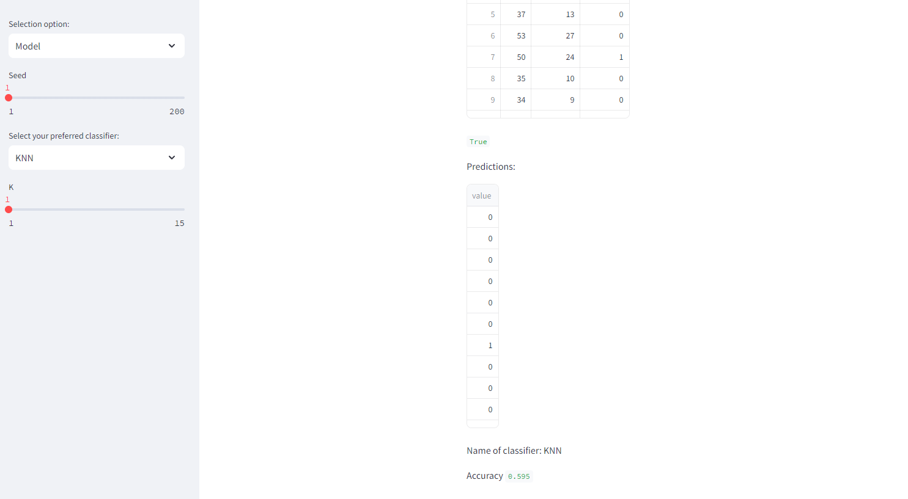

# DATA SCIENCE 

# Deploying a Streamlit ML App

Have you ever encountered difficulties in making a good presentation? Python notebooks are not clear enough for a presentation?

In this project I developed a `template` for future presentations to stakeholders using **`Streamlit`**

The main goal is to improve your next presentations!

## Context

Making a presentation and properly communicating insights is often a challenge. 
As a solution, it is possible to deploy an app using python code in which it is possible to import a dataset and then perform 3 steps common to all analysis:

- `Exploratory Data analysis` (EDA)
- `Data visualization`
- `Machine Learning models` (prediction, classification, clustering)

## Dataset

As an example for the user and the demonstration we will use the dataset shown below.

It is important to note that the user can use his own dataset and import it in any format (CSV, XLSX, TXT, JSON).

[Dataset](https://github.com/fedeandresg/streamlit_data_app/blob/main/Bank_Personal_Loan_Modelling.csv)

## EDA

Once the dataset is loaded, it can be used for any of the following steps.

As you can see, it is possible to observe the dataset and start with the first analyses to identify, among other things, dimensions, column names, correlation, etc.

## Visualization

In this section it is possible to make correlation graphs, frequency distributions and pie charts by selecting one or several columns of the dataset.

## ML models

Finally, you can choose between several Machine Learning classification models and adjust hyperparameters and seed. The app shows at the end the accuracy of the model.

## Deployment

The code developed in the [mlapp.py](https://github.com/fedeandresg/streamlit_data_app/blob/main/mlapp.py) file was developed using `Python` and was deployed using the `Streamlit` service.

Below is the link for testing:

[Link deployment](https://improvepresentations.streamlit.app/)

